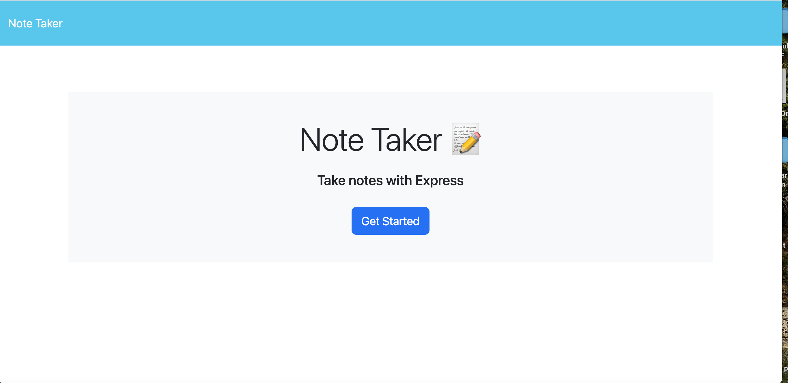
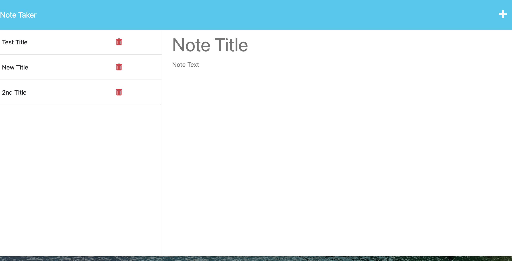

# 11-NOTE-TAKER

## Table of Contents
  - [Description](#description)
  - [Deployed Application Link](#deployed)
  - [Screenshots](#screenshots)
  - [Contact](#contact)
 
## Description
This application uses Express back end and will save and retrieve note data from a JSON file.

## Deployed Application Link

## Screenshots

Main Page
   
     

Notes Page
   
     

## Contact
You can contact me via email: marialda@bellsouth.net